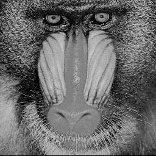

# Exercise 01 – Homogeneous Coordinates

This exercise is part of the course **Photogrammetric Computer Vision**  
in the **M.Sc. Geodesy and Geoinformation Science** program at  
**Technische Universität Berlin (TU Berlin)**.

The goal of this exercise is to introduce **homogeneous coordinates** and
basic **projective geometry** concepts through practical Python
implementations and image-based examples.

---

## Objectives

- Understand the representation of 2D points and lines in homogeneous coordinates
- Convert between Euclidean and homogeneous coordinate systems
- Apply basic geometric transformations in homogeneous space
- Visualize the effects of projective transformations on image data

---

## Contents

- `Pcv1.py`  
  Core functions for handling homogeneous coordinates, geometric entities,
  and basic transformations.

- `main.py`  
  Example script demonstrating the use of homogeneous coordinates on an
  image (Mandrill test image).

- `unit_test.py`  
  Simple unit tests to verify the correctness of implemented functions.

- `mandrill.png`  
  Input test image.

- `output_mandrill.png`  
  Output image after applying homogeneous coordinate transformations.

---

## Example

The exercise includes a demonstration where an input grayscale image
is transformed using homogeneous coordinate operations. This illustrates
how projective geometry affects image representation and coordinate
mapping.

---

## Example Output

The following figures show the result of applying homogeneous coordinate
operations and basic projective transformations to a test image.

### Input Image

The original grayscale image is used as input to demonstrate geometric
transformations in homogeneous coordinates.

### Output Image

The output image shows the result after applying transformations defined
in homogeneous space. These operations illustrate how points and image
coordinates are affected by projective geometry, while preserving the
overall structure of the scene.

---

## Technologies

- Python 3
- NumPy
- OpenCV (cv2)

---

## Academic Context

This exercise was completed as part of coursework at **TU Berlin** under
the supervision of:

**Prof. Olaf Hellwich**  
Professor of Computer Vision & Remote Sensing  
Technische Universität Berlin

---

## Notes

This repository is intended for educational purposes and demonstrates
foundational concepts in photogrammetric computer vision.
