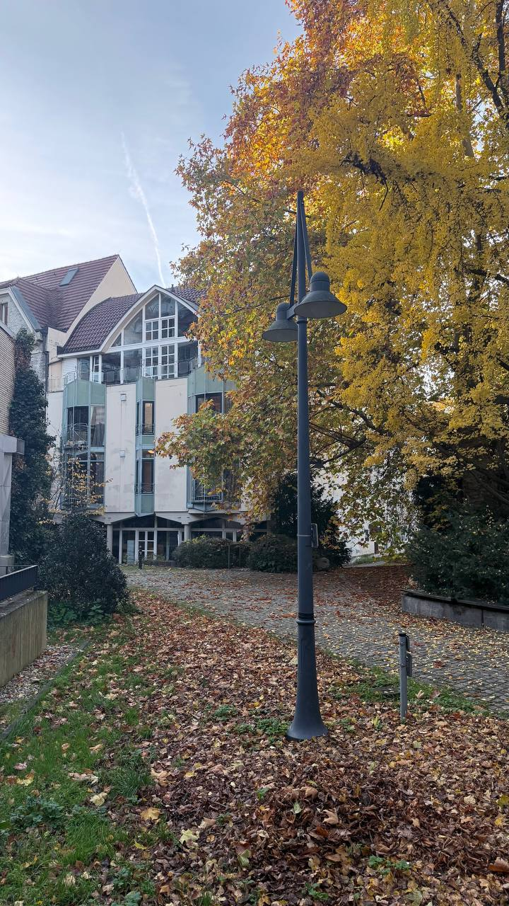
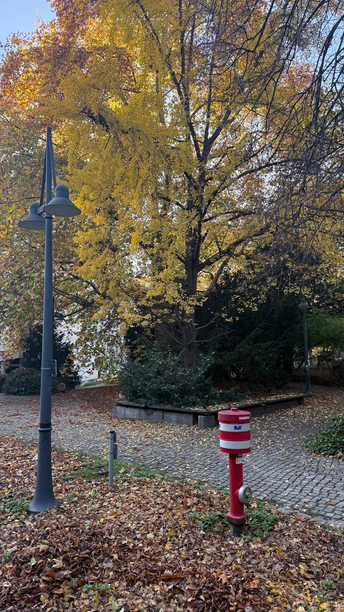
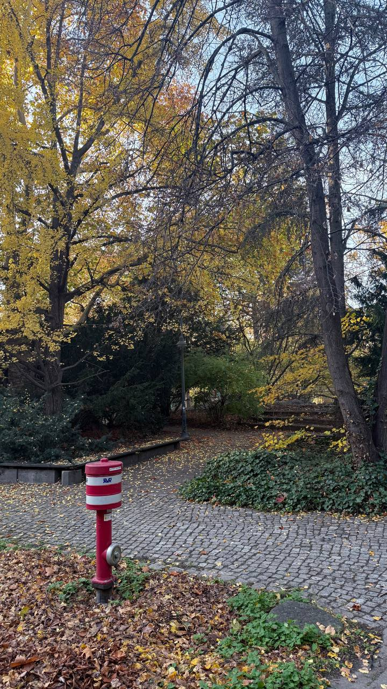
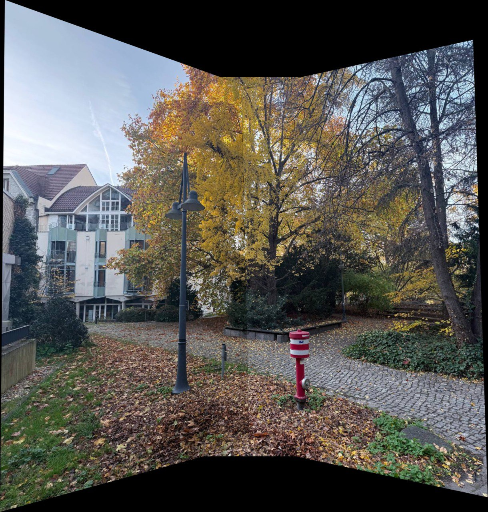

# Exercise 02 – Projective Transformation (Homography)

This exercise is part of the course **Photogrammetric Computer Vision**  
in the **M.Sc. Geodesy and Geoinformation Science** program at  
**Technische Universität Berlin (TU Berlin)**.

The aim of this exercise is to introduce **projective transformations**
and **homographies**, and to apply them to real image data for
image rectification and panorama generation.

---

## Objectives

- Understand projective transformations in 2D
- Compute homographies from corresponding image points
- Apply homographies to warp and align images
- Generate a simple panorama from multiple overlapping images
- Visualize the effect of projective geometry on image alignment

---

## Contents

- `Pcv2.py`  
  Core implementation of homography computation and image warping.

- `Helper.py`  
  Supporting functions for point handling and transformations.

- `main.py`  
  Main script demonstrating homography estimation and panorama creation.

- `unit_test.py`  
  Basic unit tests for validating homography-related functions.

- `1.jpg`, `2.jpg`, `3.jpg`  
  Input images with overlapping fields of view.

- `panorama.png`  
  Output panorama image created using projective transformations.

---

## Method Overview

1. **Point Correspondences**  
   Corresponding points are selected between overlapping images.

2. **Homography Estimation**  
   A homography matrix is computed to describe the projective mapping
   between image planes.

3. **Image Warping**  
   Images are warped into a common reference frame using the estimated
   homography.

4. **Panorama Construction**  
   Warped images are combined to form a single panoramic image.

---

## Example Result

### Input Images

The following images serve as input for homography estimation and panorama creation:

| Image 1 | Image 2 | Image 3 |
|--------|--------|--------|
|  |  |  |

These images have overlapping regions that allow the estimation of
projective transformations.

---

### Output Panorama

The final panorama is created by warping and stitching the input images
using homography-based projective transformations.  
This result demonstrates how projective geometry enables consistent
alignment of images taken from different viewpoints.

---

## Technologies

- Python 3
- NumPy
- OpenCV (cv2)

---

## Academic Context

This exercise was completed as part of coursework at **TU Berlin** under
the supervision of:

**Prof. Olaf Hellwich**  
Professor of Computer Vision & Remote Sensing  
Technische Universität Berlin

---

## Notes

This exercise focuses on foundational concepts in projective geometry
and homography estimation and serves as a basis for more advanced
computer vision tasks such as camera calibration and structure from motion.
