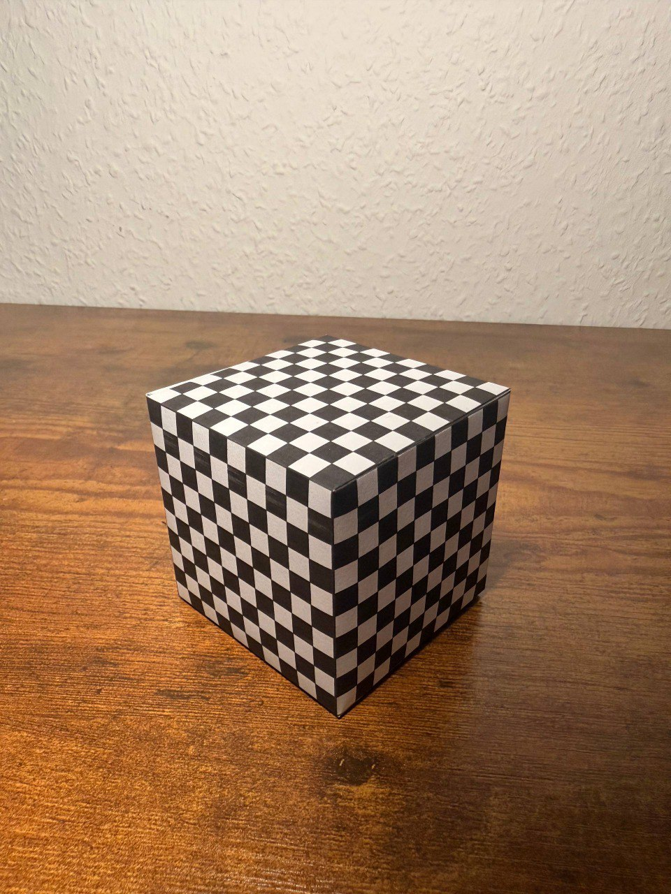

# Exercise 03 – Camera Calibration (DLT)

This exercise is part of the course **Photogrammetric Computer Vision**  
in the **M.Sc. Geodesy and Geoinformation Science** program at  
**Technische Universität Berlin (TU Berlin)**.

The objective of this exercise is to perform **camera calibration**
using the **Direct Linear Transformation (DLT)** method based on
known **2D–3D point correspondences**.

---

## Objectives

- Understand the pinhole camera model and projective camera geometry
- Estimate a camera projection matrix using Direct Linear Transformation (DLT)
- Decompose the projection matrix into intrinsic and extrinsic parameters
- Interpret camera orientation and camera position
- Evaluate the quality of the calibration results

---

## Contents

- `Pcv3.py`  
  Implementation of the Direct Linear Transformation (DLT) algorithm
  for estimating the camera projection matrix.

- `Helper.py`  
  Helper utilities for reading 3D object points, handling projection
  matrices, and interpreting camera parameters.

- `main.py`  
  Main script that loads 2D–3D correspondences, estimates the camera
  projection matrix, and prints intrinsic and extrinsic parameters.

- `points3D.txt`  
  Input file containing known 3D object coordinates.

- `cube.jpg`  
  Input image used for camera calibration.

---

## Method Overview

1. **Input Data**
   - Known 3D object points (world coordinates)
   - Corresponding 2D image points selected manually in the image

2. **DLT Estimation**
   - A linear system is constructed from the 2D–3D correspondences
   - The camera projection matrix is estimated using Singular Value Decomposition (SVD)

3. **Matrix Decomposition**
   - The projection matrix is decomposed into:
     - intrinsic camera matrix **K**
     - rotation matrix **R**
     - camera center **C**

4. **Interpretation**
   - Camera orientation and position are interpreted geometrically

---

## Example Input

### Input Image


The image shows a cube with known geometry.  
Image points are clicked **in the same order** as the 3D points listed
in `points3D.txt`.

### 3D Object Points
The file `points3D.txt` contains known 3D coordinates of cube corners
defined in a local object coordinate system.

---

## Program Execution

```bash
python3 main.py cube.jpg points3D.txt
During execution, the user is prompted to click image points corresponding to the listed 3D points. After pressing `ESC`, the calibration results are computed and printed.
```
---

## Example Output / Results

After selecting the image points and running the program, the following
camera parameters were obtained.

### Intrinsic Camera Matrix (K)

```text
[ 1.07702894e+03 2.47724297e+01 4.91869069e+02
  0.00000000e+00 1.10522943e+03 6.90109642e+02
  0.00000000e+00 0.00000000e+00 1.00000000e+00 ]
```

**Interpretation:**
- Principal distance (focal length): **1077.03 px**
- Aspect ratio: **1.026**
- Skew angle: **88.68°**
- Principal point: **(491.87 , 690.11) px**

---

### Rotation Matrix (R)

```text
[ -0.72704137 -0.68655723 -0.00707269
  -0.36471449  0.37745196  0.85118351
   0.58171659 -0.62142513  0.52482055 ]
```

---

### Camera Orientation and Position

- Omega (ω): **49.82°**
- Phi (φ): **35.57°**
- Kappa (κ): **153.36°**

- Camera center:
  **(11.89 , -7.12 , 11.33)**

These values describe the orientation and position of the camera in the
object coordinate system and demonstrate successful camera calibration
using the Direct Linear Transformation (DLT) method.

## Technologies

- Python 3 – core implementation
- NumPy – matrix operations and linear algebra
- OpenCV (cv2) – image handling and interactive point selection
- Git & GitHub – version control

### Academic Context

This exercise was completed as part of coursework at TU Berlin under
the supervision of:

**Prof. Olaf Hellwich**
Professor of Computer Vision & Remote Sensing
Technische Universität Berlin

### Notes
This repository is intended for educational purposes and demonstrates foundational concepts in photogrammetric computer vision.≈
