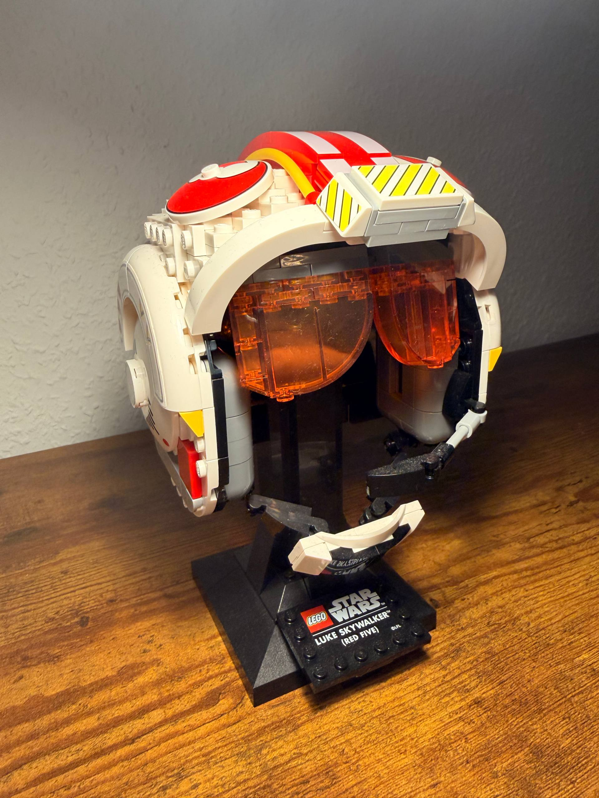
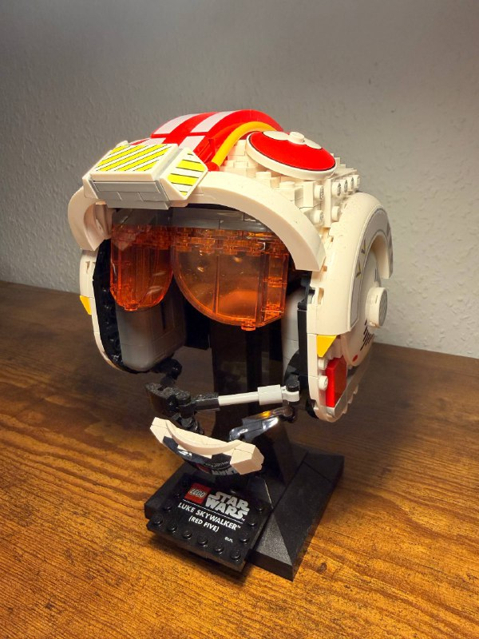
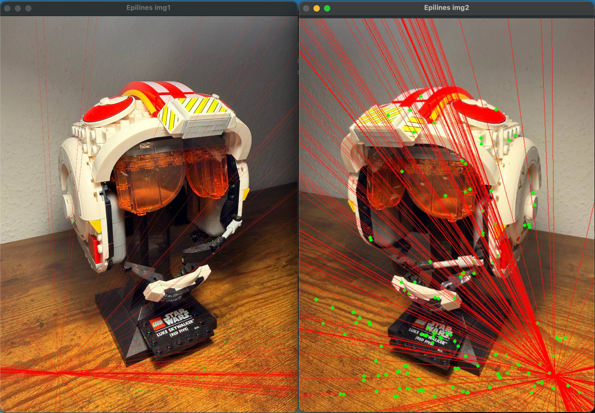

# Exercise 04 – Fundamental Matrix Estimation

This exercise is part of the course **Photogrammetric Computer Vision**  
in the **M.Sc. Geodesy and Geoinformation Science** program at  
**Technische Universität Berlin (TU Berlin)**.

The objective of this exercise is to estimate the **fundamental matrix**
between two images in order to describe the **epipolar geometry**
of an image pair.
Both **manual** and **automatic** point correspondence methods are used,
including robust estimation.

---

## Objectives

- Understand epipolar geometry and relative orientation of image pairs
- Estimate the fundamental matrix using the normalized 8-point algorithm
- Visualize epipolar lines in both images
- Evaluate the geometric accuracy using epipolar distance
- Handle outliers using robust estimation (RANSAC)

---

## Contents

- `Pcv4.py`  
  Implementation of fundamental matrix estimation, including
  conditioning, design matrix construction, singularity enforcement,
  deconditioning, error computation, and RANSAC-based estimation.

- `Helper.py`  
  Helper utilities for feature matching, epipolar line visualization,
  and point handling.

- `main_manual.py`  
  Main script for **manual selection** of homologous points and
  fundamental matrix estimation.

- `main_automatic.py`  
  Main script for **automatic point matching** using ORB features,
  followed by fundamental matrix estimation and evaluation.

- `unit_test.py`  
  Unit tests for validating the implemented methods.

- `img1.jpg`  
  First input image.

- `img2.jpg`  
  Second input image.

- `Result.jpg`  
  Visualization of epipolar lines for the estimated fundamental matrix.

---

## Method Overview

1. **Input Data**
   - Two images of a rigid object captured from different viewpoints
   - Corresponding image points (manual or automatic)

2. **Fundamental Matrix Estimation**
   - Image points are conditioned
   - A design matrix is constructed using point correspondences
   - The fundamental matrix is estimated using Singular Value Decomposition (SVD)
   - Rank-2 constraint is enforced

3. **Visualization**
   - Corresponding points are marked in both images
   - Epipolar lines are drawn using the estimated fundamental matrix

4. **Evaluation**
   - Geometric error is computed using the symmetric epipolar distance
   - Number of inliers is determined
   - Robust estimation is performed using RANSAC

---

## Example Input

### Input Images

 

The images show a spatially structured object observed from two different
viewpoints.

---

## Program Execution

### Manual Point Selection

```bash
python3 main_manual.py
```
The user is prompted to manually select corresponding points in both images.
After finishing the selection, the fundamental matrix is computed and
visualized.


### Automatic Point Matching

```bash
python3 main_automatic.py
```
Keypoints are detected automatically, matched, filtered, and used for
fundamental matrix estimation.

---

### Example Output / Results

After estimation, the epipolar geometry is visualized by drawing epipolar
lines in both images.

**Epipolar Line Visualization**


The epipolar lines intersect at the epipoles and demonstrate the correctness
of the estimated fundamental matrix.

---

### Technologies

- Python 3 – core implementation

- NumPy – matrix operations and linear algebra

- OpenCV (cv2) – image processing, feature detection, and visualization

- Git & GitHub – version control

### Academic Context

This exercise was completed as part of coursework at TU Berlin under
the supervision of:

Prof. Olaf Hellwich
Professor of Computer Vision & Remote Sensing
Technische Universität Berlin

### Notes

This repository is intended for educational purposes and demonstrates
core concepts of epipolar geometry and relative orientation in
photogrammetric computer vision.
