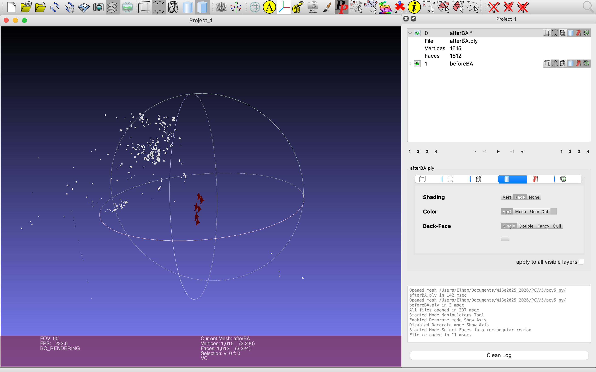

# Exercise 05 – Structure from Motion (SfM)

This exercise is part of the course **Photogrammetric Computer Vision**  
in the **M.Sc. Geodesy and Geoinformation Science** program at  
**Technische Universität Berlin (TU Berlin)**.

The aim of this exercise is to implement **Structure from Motion (SfM)**
for sparse 3D reconstruction from multiple images, including camera pose
estimation, triangulation of 3D points, and refinement using
**bundle adjustment**.

---

## Objectives

- Understand the principles of Structure from Motion
- Estimate relative camera motion from image correspondences
- Reconstruct a sparse 3D point cloud from multiple views
- Refine camera parameters and 3D structure using bundle adjustment
- Export and visualize reconstructed 3D point clouds

---

## Contents

- `Pcv5.py`  
  Core implementation of the Structure from Motion pipeline, including
  scene representation, projection models, and bundle adjustment.

- `Helper.py`  
  Supporting utility functions for geometry, optimization, and
  visualization.

- `main.py`  
  Main script executing the SfM pipeline and exporting results.

- `unit_test.py`  
  Unit tests for validating the implemented methods.

- `beforeBA.ply`  
  Sparse 3D reconstruction before bundle adjustment.

- `afterBA.ply`  
  Sparse 3D reconstruction after bundle adjustment.

- `pcv5_result.npz`  
  Stored intermediate and final results.

---

## Method Overview

1. **Input Images**  
   Multiple images of a static scene captured from different viewpoints.

2. **Feature Correspondences**  
   Feature points are detected and matched between images to establish
   correspondences.

3. **Camera Pose Estimation**  
   Relative camera motion is estimated based on epipolar geometry.

4. **Sparse Reconstruction**  
   3D scene points are triangulated from multi-view correspondences.

5. **Bundle Adjustment**  
   Camera parameters and 3D point coordinates are jointly optimized to
   minimize reprojection error.

---

## Example Result

### Input Images

The following images serve as input for the Structure from Motion
pipeline and show a static scene observed from different viewpoints.

| Image 1 | Image 2 | Image 3 |
|--------|--------|--------|
|  |  |  |

---

### Output Reconstruction

After running the SfM pipeline, sparse 3D reconstructions are obtained
before and after bundle adjustment.

- **beforeBA.ply** – initial reconstruction  
- **afterBA.ply** – refined reconstruction  

The refined result demonstrates improved geometric consistency due to
bundle adjustment.

---

## Visualization

The reconstructed sparse point clouds were visualized using external 3D
visualization software:

- **MeshLab**
- **CloudCompare**

These tools allow interactive inspection of the reconstructed geometry
and facilitate comparison of the results before and after bundle
adjustment.

The figure below shows the reconstructed scene and estimated camera
positions after bundle adjustment.

  

---

## Technologies

- Python 3 – core implementation
- NumPy – linear algebra and numerical computation
- OpenCV (cv2) – image handling and feature processing
- MeshLab / CloudCompare – 3D point cloud visualization
- Git & GitHub – version control

---

## Academic Context

This exercise was completed as part of coursework at **TU Berlin** under
the supervision of:

**Prof. Olaf Hellwich**  
Professor of Computer Vision & Remote Sensing  
Technische Universität Berlin

---

## Notes

This exercise builds upon previous topics such as homography estimation
and epipolar geometry and provides an introduction to full 3D scene
reconstruction using Structure from Motion.
